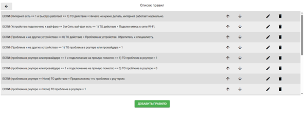
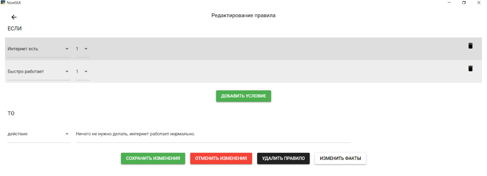
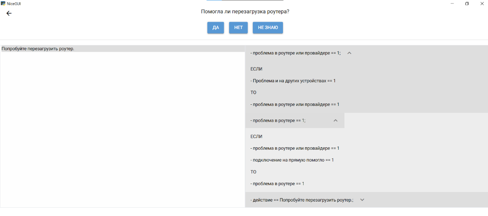

# Экспертная система

Интерактивная экспертная система для диагностики на основе правил. Реализует прямой вывод (forward chaining) и предоставляет удобный веб-интерфейс для работы с базой знаний и консультацией пользователя.

## Основные возможности

### 1. Редактирование базы знаний

Пользователь может изменять базу знаний через интерфейс. База знаний состоит из фактов (текущие характеристики оборудования) и правил (условия и действия, которые выводятся системой на основе фактов).

#### Список правил

Пользователь может просматривать, добавлять, редактировать и удалять правила. Каждое правило состоит из двух частей: условие и действие.

#### Изменение конкретного правила

Интерфейс позволяет редактировать условия и действия правила для актуализации базы знаний.

#### Изменение фактов

Факты представляют собой текущие данные о состоянии оборудования, которые можно изменять в процессе работы системы.

### 2. Механизм консультации

Система может интерактивно взаимодействовать с пользователем, задавая вопросы по текущим характеристикам оборудования. На основе ответов система определяет возможные неисправности и дает рекомендации.

## 📂 Структура базы знаний

База знаний состоит из:

- **Фактов** — данные о состоянии техники
- **Правил** — логика вывода диагноза

Каждое правило имеет:

- **ЕСЛИ**: одно или несколько условий (например, температура > 80°C)
- **ТО**: действие (например, "Перегрев процессора")

## Интерфейс

### Список и редактирование правил

### Работа с фактами

### Механизм консультации

## 🛠️ Стек

- 🐍 Python
- 🌐 [NiceGUI](https://nicegui.io/) — UI-фреймворк
- 🗂️ JSON — формат хранения правил и фактов

Система задаёт вопросы пользователю и, на основе ответов, строит цепочку вывода, формируя рекомендации и диагноз.
